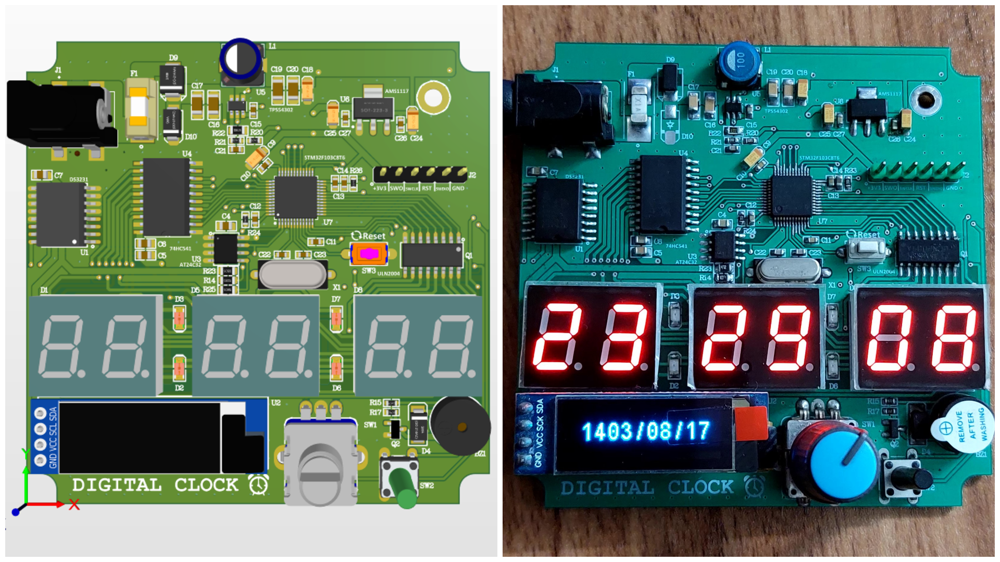

# Digital Clock & Calendar ⏰📆

This project is a **digital clock and calendar** based on the **STM32F103C8T6** microcontroller. It displays the **time (hours, minutes, seconds)** on a 7-segment display and the **date and weekday** on a **0.91" 128x32 OLED** screen.

The project utilizes the **DS3231 RTC** IC for accurate timekeeping and an **AT24C32 EEPROM** for data storage.

## 💡 Features

- Displays **current time (HH:MM:SS)** on a 7-segment display
- Shows **date (DD/MM/YYYY)** and **day of the week** on a 0.91" OLED display (128x32 pixels)
- Uses **DS3231** for real-time clock functionality
- Includes **AT24C32 EEPROM** for non-volatile data storage

## 🔧 Hardware Components

- STM32F103C8T6
- DS3231 RTC Module
- AT24C32 EEPROM Module
- 3*2-digit 7-Segment Display (CA - 20.1mm * 16mm)
- 0.91" I2C OLED Display (128x32 pixels, SSD1306 driver)
- Rotary Encoder for set time and date

